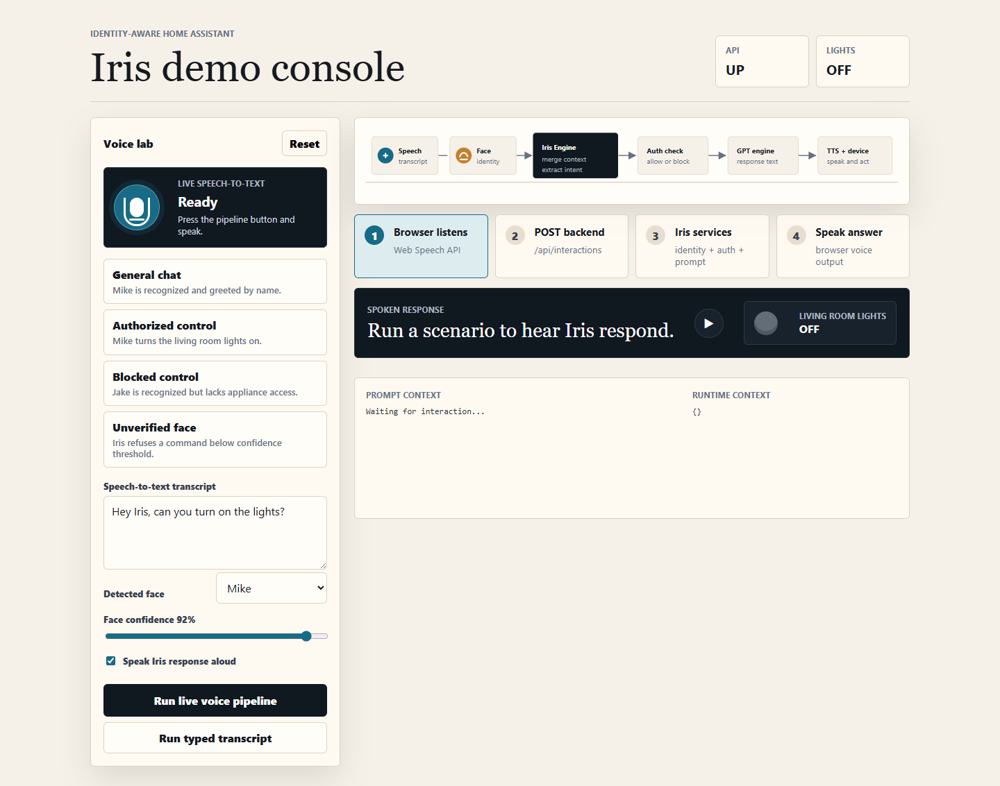
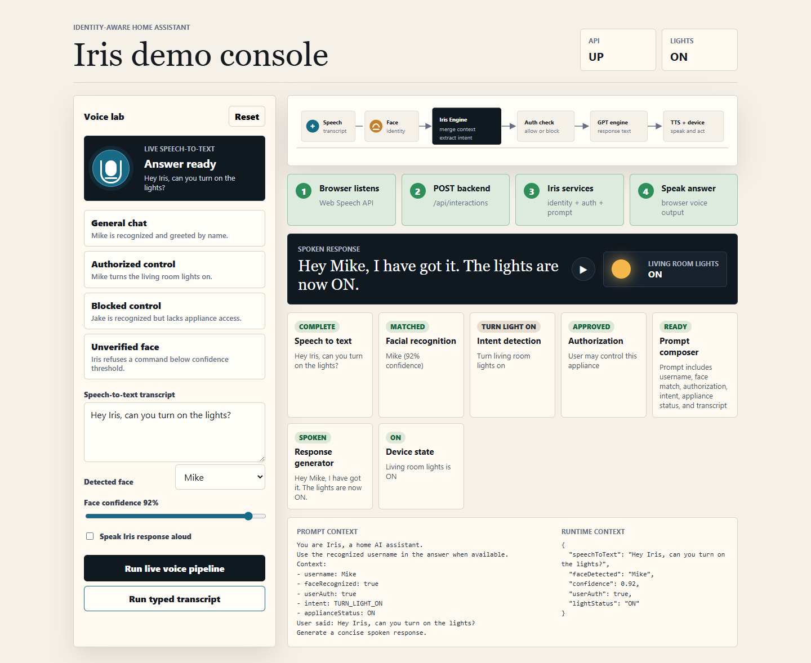

# Iris Assistant Spring Boot Demo

This is an end-to-end Spring Boot application for the Iris identity-recognition flow from the supplied deck. It simulates the full loop:

1. Speech-to-text transcript enters the system.
2. Facial recognition identifies the speaker and confidence.
3. Intent detection decides whether the user wants conversation or light control.
4. Authorization checks appliance access.
5. A prompt is composed for the response generator.
6. Iris speaks a response and updates device state when allowed.

## What is included

- Spring Boot REST API under `/api`
- In-memory user directory with Mike, Aisha, Jake, and unknown speaker behavior
- In-memory appliance state for `living-room-lights`
- Interactive browser UI at `http://localhost:8080`
- Live speech-to-text in Chrome or Edge on localhost
- Browser speech output for Iris responses
- Scenario buttons for general chat, authorized control, blocked control, and unverified face
- Smoke-test script for the API flow

## Output showcase

Starting screen after the Spring Boot app is running:



Completed pipeline after running the typed transcript demo:



## Run with Maven

```powershell
cd iris-assistant-springboot
mvn spring-boot:run
```

Open `http://localhost:8080`.

If port 8080 is already busy, run:

```powershell
mvn spring-boot:run -Dspring-boot.run.arguments="--server.port=8081"
```

Open `http://localhost:8081`.

The primary `Run live voice pipeline` button starts browser speech recognition, places the converted transcript into the page, sends it to the Spring Boot backend, and speaks the backend response aloud. Chrome or Edge may ask for microphone permission the first time.

## Run without Maven on PATH

This workspace did not have `mvn` on PATH during verification, so a local fallback script is included. It compiles with `javac` and uses the jars already present in your local Maven cache:

```powershell
cd iris-assistant-springboot
.\scripts\compile-and-run-local.ps1 -Port 8081
```

## API examples

Health:

```powershell
Invoke-RestMethod http://localhost:8080/api/health
```

Run an authorized light command:

```powershell
$body = @{
  transcript = "Hey Iris, can you turn on the lights?"
  faceId = "mike"
  confidence = 0.94
} | ConvertTo-Json

Invoke-RestMethod -Method Post http://localhost:8080/api/interactions -ContentType "application/json" -Body $body
```

Run the smoke test after the app starts:

```powershell
.\scripts\smoke-test.ps1
```

## Demo script

- Start with `General chat`: Iris uses the recognized name without controlling a device.
- Move to `Authorized control`: Mike passes identity and authorization, so the lights turn ON.
- Click `Blocked control`: Jake is recognized, but the authorization step blocks the command.
- Click `Unverified face`: the confidence threshold blocks the command before device control.

## Extension points

- Replace `FaceRecognitionService` with a real model adapter.
- Replace `CommandInterpreter` with an NLP model or intent service.
- Replace `ResponseGenerator` with a real GPT API adapter.
- Replace `ApplianceService` with MQTT, Matter, Home Assistant, or vendor device APIs.
